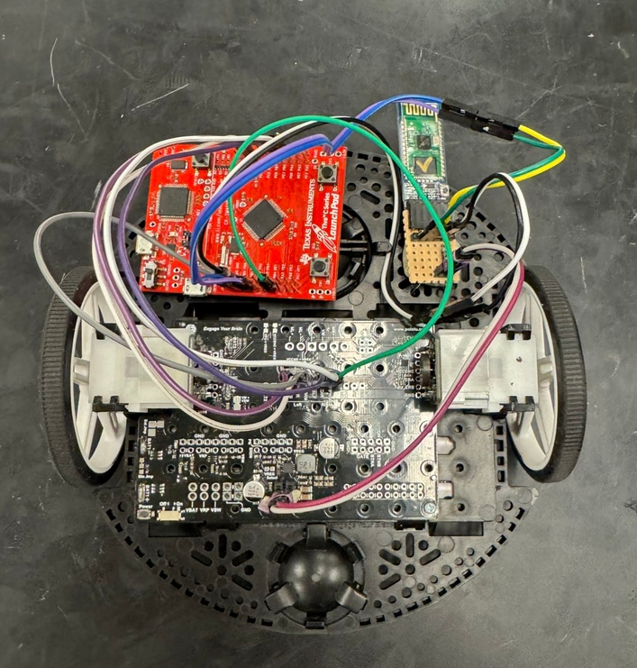
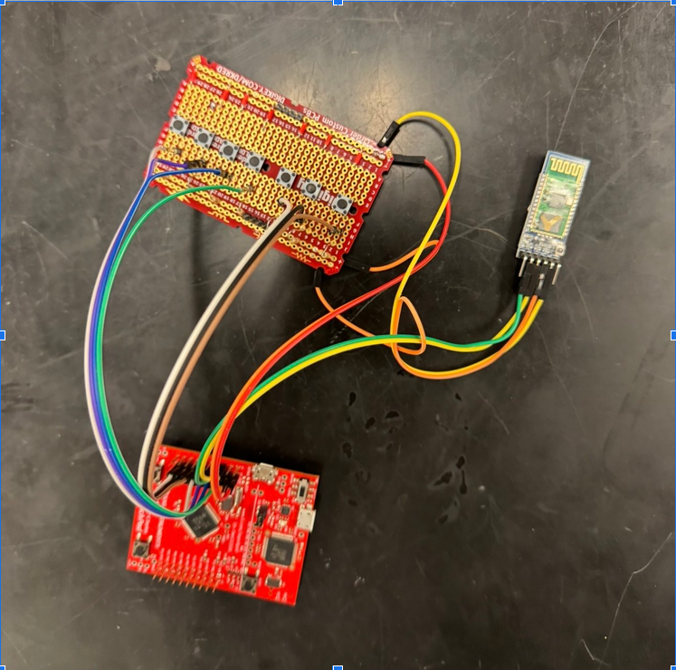

# Bluetooth Remote Control Car

## Robot Car

## Uart controller 

## Description
Project Description 
This project consists of two parts, with this being the second section. In the first part, we learned to control a small car using analog sensors such as the Sharp GP2Y0A41SK0F IR Sensor to prevent collisions with obstacles. Now, in this second part, we transitioned to controlling the same car using an HC-05 Bluetooth module, which communicates via UART serial communication.

The functions for motor control developed in Part One were abstracted and reused in Part Two. These functions are now triggered by specific characters received over the UART interface from the HC-05 module. When the module detects a particular character, it performs the following actions:

F: Move forward
B: Move backward
L: Turn left
R: Turn right
U: Increase speed
D: Decrease speed
S: Stop
I found the standard UART terminal interface for interacting with the car to be slow and cumbersome. To address this, I developed a second UART-based project specifically designed as a dedicated controller. This custom controller pairs the HC-05 modules using their AT command mode, allowing them to pair automatically on power-up. The controller acts as the master device, sending commands based on edge interrupts from specific GPIO pins: PD0–PD3 and PE1–PE3.

The car is designed in such a way that it remains completely transparent to the user, allowing seamless switching between the custom UART controller and a traditional terminal interface if needed. This modularity ensures flexibility for testing, debugging, or adapting the system to different use cases.
Demo video on youtube : https://youtu.be/GN0xLZdjtnU