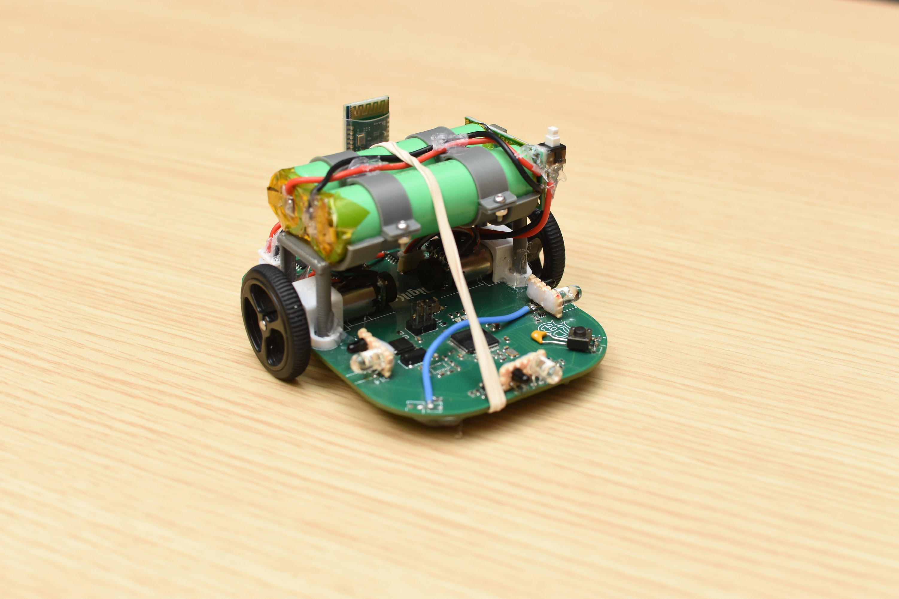

# Club Project Micromouse competition

## Description
This micromouse is based of a STM32f411 microcontroller programed in C through the STM Cube ide. It solves a maze using the flood fill algorithm. It accomplishes this by keeping track of the walls in the maze with an array which is updated as it travels the maze. It senses walls using a pair of IR emitters and transistors. The mouse moves using dc motors controlled by a PID loop and is kept in a straight line by using encoders. This micro mouse is based on an STM32F411 microcontroller programmed in C using the STM Cube IDE. It solves mazes using the flood fill algorithm, which relies on maintaining a wall map stored in an array that updates dynamically as the mouse navigates through the maze.

Wall detection is achieved using a pair of IR emitters and phototransistors (or IR sensors). The micro mouse's movement is controlled by DC motors, which are regulated via a PID loop to ensure precise speed control. To maintain straight-line travel, encoders are used to track motor rotation and provide feedback for accurate positioning. It makes uses of the following features: I2C, ADC, UART , HC-05 (Bluetooth Serial Terminal).

Some code snippets are in the code snippets folder including api.h (the motor control api), floodfill.h (floodfill to solve maze), trapizoid.h (the pid loop that controls motor speeds).

